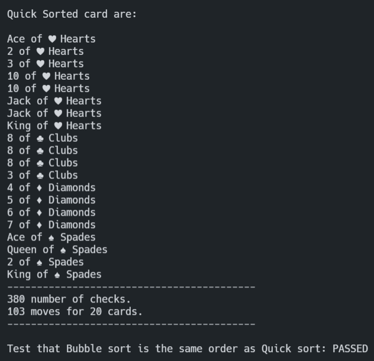

# CS1FC16 Spring Term Coursework - Card Sorting by Algorithms and Tree

**Module Title:** Fundamentals of Computer Science

**Assignment report Title:** Card Sorting by Algorithms and Tree

**Module Code:**  CS1FC16

**Student Number:** 30021591

**Git Repository:** <https://csgitlab.reading.ac.uk/il021591/cs1fc16_card_sorting_algo.git>

**Lecturer responsible:** Prof Richard Mitchell

**Weighting of the Assignment:** 7.5%

**Due in Date:** 17th March 2022 @ 12

**Actual hrs spent for the assignment:** 8 hrs

**Assignment evaluation :** Deeper understand of sorting algorithms and binary sorted tree. Helped increase confidante to program in C and C++.

## Usage

Download the repo using the following command

```BASH
git clone https://csgitlab.reading.ac.uk/il021591/cs1fc16_card_sorting_algo.git
```

To compile the sorting algorithms and run type this in the terminal

```BASH
make sort
```

To compile the tree algorithms and run type this in the terminal

```BASH
make tree
```

## Introduction

The objective of this coursework was to understand sorting algorithms and binary sorted tree using playing cards. To sort the cards individuals had to use the code provided to create algorithms that used the bubble sort and quick sort method. Furthermore, a separate piece of code was also needed to be produced to utilise binary sorted tree structure to store and interact with the cards.

## Sorting Program

As Stated in the introduction two sorting algorithms will be used and tested to demonstrate the performance of the different sorting algorithms and its time complexity. A simple counter that measures the number of times each algorithm checks and moves cards has also been implemented.

### Bubble Sort

The Algorithm used to sort the stack of cards is by looping an if statement in `maxCard-1`  iteration of I and j using it calls the swap function and swaps the current item in the stack and the next item if its larger. Finally returning the stack.

``` c++
aCard* bubbleSort(aCard c[], bool val)               // bubbleSort algorithm which returns a pointer to a card, and takes in a list of cards and boolean values if to sort by  card value or card sute
{       

    for (int j = 0; j < (maxCard-1); j++)            // for i in maxCard-1 and for j in maxCard-1 loops trough the pack, hence the big O sorting in exponential time.
    {
        for (int i = 0; i < (maxCard-1); i++)
        {
            if (corOrder(c[i], c[i+1], val) == 1)    // used the checker function to check if card i has a greater value than card i+1 if so do the following
            {
                swap( c[i], c[i + 1]);
                sortCounter++;                       // sort counter increments yet again
            }
        }
    }    
    return c;                                        // return a pointer of the array of sorted cards
}
```
Bubble Sort Output

#### The Swap function

This function is used by both sorting algorithms and essentially initiates an `aCard` struct `x` to temporarily store the card that’s being worked on and then set the first position in the card to `x`. then setting the value of the card in the second position to the value of the card in the first position. Finally, setting the value of `x` to the value of the card in the second position.

``` c++
void swap(aCard c[], int pos1, int pos2){          // swap function to swap 2 cards in a pack
 aCard x;                                         // temporary variable to store the card that will be swapped
 x = c[pos1];                                     // setting the value of the card in position 1 to the variable x
 c[pos1] = c[pos2];                               // Setting the value of the card in position 1 to the value of the card in position 2
 c[pos2] = x;                                     // setting the value of the card in position 2 to the variable x
}
```

#### The Compare function

The Compare Function takes in three arguments, two `aCards`, and a Boolean value to ether compare by `cardVal` or `cardSuit`. If value is 0(False) it sorts by `cardSuit` if its 1(True) it sorts by `cardVal` it returns true if a is bigger, then `B` and returns False if `B` is bigger than `A`.

```c++
int corOrder(aCard a, aCard b, int val)             // checker function that returns true if a is smaller than b. val is used to determine if cardVal or cardSuit is being checked
{
    corOrderCounter++;                              // checker function counter increments by one

    if (val != 0)                                   //if value of card is what requested to be checked then ...
    {
        if (a.cardVal < b.cardVal){return true;}    // returns true if cardVal of a is smaller than b
        else return false;
    }
    else if(val != 1)                               // does the same but with cardSuit
    {
        if (a.cardSuit < b.cardSuit){return true;}
        else return false;
    }
    return -1;
}

```

#### Quick Sort and the partitioning Function

As the time complexity of bubble sort is `Θ(N^2)` it’s not expected to be the optimum way of sorting list Quick sort is often used. The Quicksort algorithm consists of two functions the quicksort function which is called recursively until the last two items are sorted and a partition function which finds the pivot and devise the list. Here the swap function is also used to swap the card in the current iteration with the left integer.

``` c++
aCard* quickSort(aCard c[], int left, int right, bool val) // quickSort function will return aCard and takes in aCard left right and val arguments. This function will be called recursively.
{
    if (left >= right) return c;                     // if left is less than ore equal to right return
    int piv;                                         // inital pivot

    piv = partition(c, left, right, val);            // pivot is the output of the partition function
    
    quickSort(c, left, (piv-1), val);               // recursively call quickSort with the left partition of the array
    quickSort(c, (piv+1), right, val);              // recursively call quickSort with the right partition of the array
    return c;
}

int partition(aCard c[], int left, int right, int val) // function used to determine the pivot point for quickSort also does the swaping
{
    aCard x;                                           // Temporary variable x to hold cards during sorting

    for (int i = left+1; i <= right; i++)              // for the left integer plus 1, until the right integer is reached increments by one
    {
        if (corOrder(c[i], c[left], val) == 1)         // if the left integer is greater than card at position i, then swap the i with the left integer
        {
            swap(c[i], c[left]);
            sortCounter++;                            // sort counter increments yet again
        }
    }

    return left;                                     // return the left integer for recursion purposes
}
```
Quick sort Output

#### Card Print Function

This simple function prints out each card int the array using the value name (e.g.: 12 as queen) as well as the suit names instead of 0,1,2 or 3. Output Example.: King of ♠️ Spades

``` c++
void printPack(aCard c[], string msg)               // Neatly print the cards using the name of the values and the suite with a emoji (nerdfonts or emoji(UNICODE) required for this to work properly)
{
    string suiteNames[] = {"♥️ Hearts", "♣️ Clubs", "♦️ Diamonds", "♠️ Spades"}; // list of suite names that will be called when suite need to be displayed
    string cardValue[] = {"-", "Ace", "2", "3", "4", "5", "6", "7", "8", "9", "10", "Jack", "Queen", "King"};// list of value names that will be called when card value need to be displayed

    cout << msg << "\n" << endl;                    // msg defined if the cards are sorted

    for (int i=0; i < maxCard; i++)                 // print each card in the pack using previously defined list.
    {
        cout << cardValue[c[i].cardVal] << " of " << suiteNames[c[i].cardSuit] << endl;
    }
            // V print out the number of cards checked and the number of cards moved.
    cout << "------------------------------------------\n" << corOrderCounter << " number of checks. \n" << sortCounter << " moves for " << maxCard << " cards." << "\n------------------------------------------\n" << endl;
}
```
Print Output

#### Tesing the Sorting Algorithms

``` c++

string testSortingAlgos(aCard a[], aCard b[]){      // test sorting algorithms by comparing bubbleSort and quickSort
    for (int i = 0; i < maxCard; i++)
    {
        if ((corOrder(a[i-maxCard], b[i],1)==1) && (corOrder(a[i-maxCard], b[i], 0)==1)) // using the corOrder function to determine if value is same
        {
            return "PASSED"; // return "PASSED or FAILED";
        }
    }
    return "FAILED";
}

```

#### Main Function for the Sorting Algorithms

``` c++

int main()
{
    cout << "Card Sorting!\n";

    for (int ct = 0; ct < maxCard; ct++)      // looping through maxCard to get the defined number of cards
    {
        thePack[ct] = getCard("30021591");    // change to your student number
    }

    printPack( thePack, "Your card are: ");   // print the cards given by the getCard function

    aCard* bubbleSortedCards;                 // define the bubble sort and quickSort aCards
    aCard* quickSortedCards;
    
    bubbleSortedCards = bubbleSort(thePack, 1); // sort the cards by their value (using 1 as true)
    bubbleSortedCards = bubbleSort(bubbleSortedCards, 0); // sort the cards by their suite (using 0 as false)
    printPack(bubbleSortedCards, "Bubble Sorted card are: "); // print the cards given by the bubbleSort function

    sortCounter = 0;            //reset counters for quickSort
    corOrderCounter = 0;

    quickSortedCards = quickSort(thePack, 0, (maxCard-1), 1);// sort the cards by their value (using 1 as true)
    quickSortedCards = quickSort(quickSortedCards, 0, (maxCard-1), 0);// sort the cards by their suite (using 0 as false)
    printPack(quickSortedCards, "Quick Sorted card are: ");// print the cards given by the quickSortedCards function

    // test that Bubble and Quick sort are the same order
    cout << "Test that Bubble sort is the same order as Quick sort: " << testSortingAlgos(bubbleSortedCards, quickSortedCards) << endl; // run the test
}
```
Quick Sort Output

## Tree Program

The tree program could be broken down into … components, the struct which used `aCard` as the data and two pointer nodes one the less side and the other on the more side. The `insertTree` creates a node and allow to append a card to the tree. `cfstring` function is used to compares two cards and returns -1,0,1. `cardNewNode` create a new node and returns a pointer. The `printTree` function prints out all the items in the tree.

``` c++
#include <string>
#include <iostream>
using namespace std;
#include "cardlib.h"

struct cardTreeNode {
    aCard card;
    cardTreeNode* less, * more; 
};

cardTreeNode* cardNewNode(cardTreeNode* l, aCard a) {       // create a new node with data s, return pointer to it
    cardTreeNode* pos = new cardTreeNode;     // create space for node
    pos->card = a;                    // add data
    pos->less = NULL;                 // pointers less and more are set to NULL
    pos->more = NULL;
    return pos;                       // return pointer to this new node 
}

int cfstring(aCard c1, aCard c2) {
    // compares two cards and  returns -1,0,1
    if (c1.cardVal <= c2.cardVal) return -1;
    else if (c1.cardVal >= c2.cardVal) return 1;
    else return 0;
}

cardTreeNode *insertTree(cardTreeNode* l, aCard a) {
    // insert string s searching from node p, returns pointer to this node (normally unchanged)
    cardTreeNode* ans = l;
    if (l == NULL) ans = cardNewNode(l, a);    // if found NULL pointer, create new node and this is returned connecting to node above
    else if (cfstring(l->card, a) >= 0) l->less = insertTree(l->less, a);    // insert in less subtree
    else if (cfstring(l->card, a) <= 0) l->more = insertTree(l->more, a);    // insert in more subtree
        // change above line if want repeat items in tree
    return ans;         // return pointer to new node, or to this node, as appropriate
}

void printTree(cardTreeNode* l){
    if (l == NULL) return;
    string suteNames[] = {"♥️ Hearts", "♣️ Clubs", "♦️ Diamonds", "♠️ Spades"};
    string cardValue[] = {"-", "Ace", "2", "3", "4", "5", "6", "7", "8", "9", "10", "Jack", "Queen", "King"};
    printTree(l->less);
    // then recur on right subtree

    printTree(l->more);
    // now deal with the node
    cout << cardValue[l->card.cardVal] << " of " << suteNames[l->card.cardSuit] << endl;
}

int main(){
    struct cardTreeNode* stack = NULL;
    aCard c;
    for(int i = 0; i < 10; i++)
    {
        c = getCard("30021591");
        stack = insertTree(stack, c);
    }
    printTree(stack);
    return 0;
}

```

Tree Output

## Reflection

In Conclusion we learned two different methods of storing items in a list. Although The Bubble sort algorithm is not efficient it gives a good incite on how things could be sorted and was easy to program. The Quick sort programs widened upon that knowledge to optimize sorting for further applications. The tree algorithm helped understand how algorithms are used in real like software systems such as databases and spreadsheets.